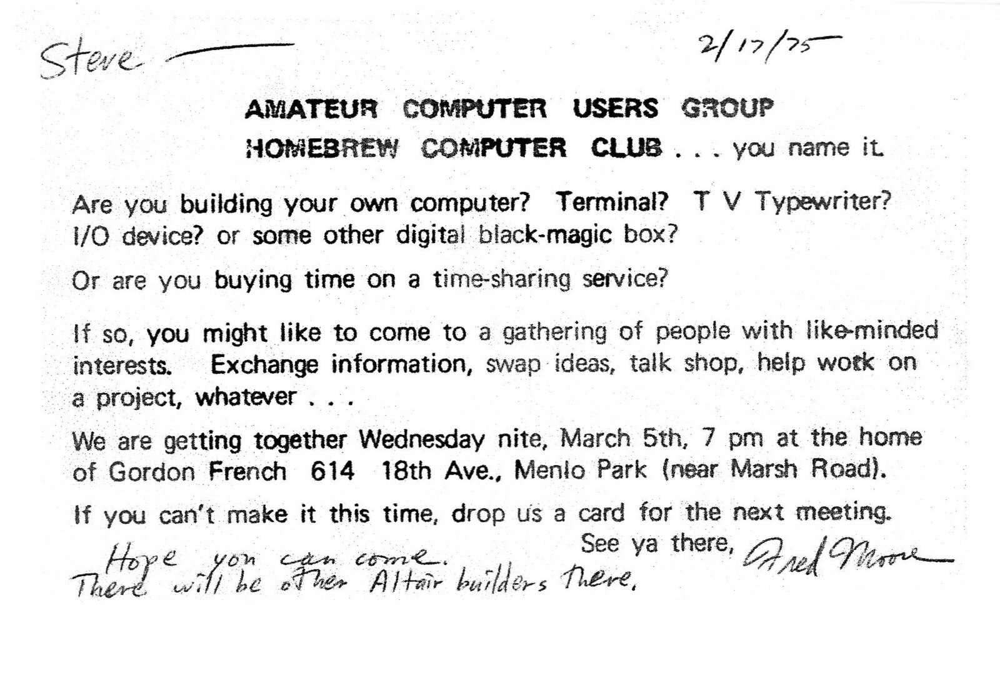
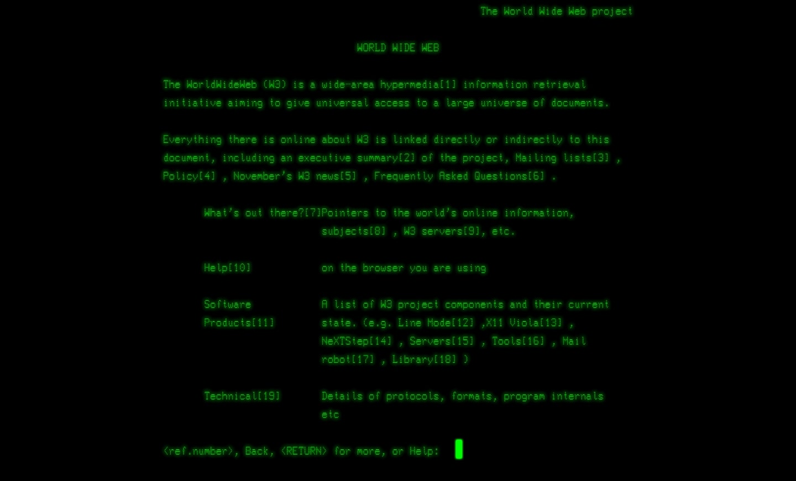

import { Callout } from 'nextra/components'

# About

🖖 High-level summary: We're brewing AI in public by solving really real AI problems.

<Callout type="info" emoji="ℹ️">
We were inspired by the [Homebrew Computer Club](https://en.wikipedia.org/wiki/Homebrew_Computer_Club), an early computer hobbyist group from 1975 to 1986 that led to Apple and the personal computer revolution.
</Callout>

_This is the first invitation from Steve Jobs to the Homebrew Computer Company, echoing the spirit of Homebrew Research: Are you experimenting with AI?_

## About Us

<Callout emoji="👾">
Homebrew is a local AI company.
</Callout>

What that means, in case you've been living under a rock (which, given the state of things, might not be such a bad idea), is that we're a bunch of well-meaning fools trying to create AI that stays put. Like a good dog. 

We call ourselves hobbyists because it sounds better than "people who should probably get out more." By the way, we're happy with that. For sure. 

We tinker with local AI, which is a fancy way of saying we're teaching machines to think without letting them run amok on the tech giants' servers. It's like raising a child in a bunker, only with less mess and more electricity bills.

### Tinkering

_Nikola Tesla, one of the greatest tinkerers, sitting in his Colorado Springs laboratory._

We're [tinkerers](https://cleanlanguage.com/stochastic-tinkering/#:~:text=Tinkering%E2%80%9D%20means%20adjusting%20and%20experimenting,art%20itself%E2%80%9D.%5B1%5D).  No fancy words, no over-sales things, we're just communicating our experiments, and learnings, and findings we're burning money to do what we want to do.  

We believe that tinkerers shape the future of technology - like how a bunch of guys who wanted to build something at home in the [Homebrew Computer Club](https://researchwith.njit.edu/en/publications/imagining-the-personal-computer-conceptualizations-of-the-homebre) have changed how we use computers.

### Defining

_[Eniac](https://www.computerhistory.org/revolution/birth-of-the-computer/4/78), the World's First Computer, had defined what a computer is._

We believe that revolutionary inventions change the definition of everything that came before them. AI is the same as computers changed commerce to media, out of the world we are surrounded by. 

So tinkering is the only way to define things using one of the best inventions we have now, called AI.

### Shaping

_Each invention comes with new problems that have never existed before them._

AI comes with hardware, optimization, and efficiency problems at a high level. Solving these problems is about experimenting with AI in these levels. At Homebrew, we're doing this. [Jan](https://jan.ai/) & [Cortex](https://cortex.so/) help us to experiment with software and hardware. Ichigo helps us to do the same on the training level.

<Callout emoji="👾">
Local AI tinkerers will shape the future using AI. Say hi to [r/LocalLlaMA](https://www.reddit.com/r/LocalLLaMA/) folks!
</Callout>

### Together

_Open collaboration at CERN made the [Word Wide Web](https://home.cern/science/computing/birth-web) possible._

We believe in [open science](https://www.cos.io/open-science) and open source. All our works are open-source and [built-in public](https://www.smallschool.is/build-in-public/what#:~:text=It%20means%20building%20a%20company,were%20making%20as%20trade%20secrets.). We provide the community with the right to tinker. Tinker, extend, customize our products to fit their needs, and expand our horizons by thinking their way.

That's why our products provide 100% ownership, are [local-first](https://www.inkandswitch.com/local-first/), and prioritize self-hosted versions.

<Callout>
We welcome business inquiries [here](https://homebrew.ltd/work-with-us).
</Callout>

We have a thriving community, where we also discuss our other projects:

- [Discord](https://discord.gg/AAGQNpJQtH)
- [Twitter](https://twitter.com/homebrewltd)
- [LinkedIn](https://www.linkedin.com/company/homebrewltd/)

You can reach out to us via hello@homebrew.ltd