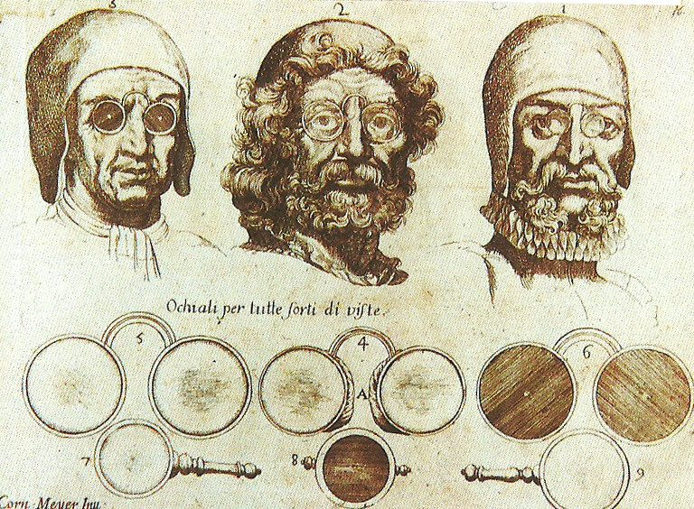

import { Callout } from 'nextra/components'

# About

☕ Coffee? No, we train AI.

_[Eniac](https://www.computerhistory.org/revolution/birth-of-the-computer/4/78), the World's First Computer (Photo courtesy of US Army)_

Homebrew is an AI research lab. Our mission is to build human-augmenting AIs that run on energy-efficient hardware.

<Callout>
We were inspired by the [Homebrew Computer Club](https://en.wikipedia.org/wiki/Homebrew_Computer_Club), an early computer hobbyist group from 1975 to 1986 that led to Apple and the personal computer revolution.
</Callout>

## What drives us

_Nikola Tesla sitting in his Colorado Springs laboratory._

When electricity first joined our homes, it was about igniting the human imagination besides banishing darkness. Those who saw its potential knew it would change every aspect of our lives. And [it did](https://www.economist.com/leaders/2000/08/03/the-electric-revolution). 

At Homebrew, we see AI the same way - as leverage to push humanity forward. We see a future with AI making us smarter, kinder, and more capable.

Like fire that cooked our food and forged our tools, or electricity that powered our cities and connected our world, AI sparks both wonder and worry. We believe that [AI augmenting human creativity](https://link.springer.com/article/10.1007/s11023-024-09677-x) will help us change the future we've yet to imagine.

### Human Augmentation

_Spectacles improved human vision._

We believe that humanity's strength lies in our ability to create and use tools that improve our lives. From the first stone tools to the smartphones in our pockets, we've always augmented our capabilities through tools.

We have a chance to build AI to enhance our abilities on:

- **Problem-solving**: AI that enhances our abilities and expands our potential
- **Collaboration**: AI that we can tinker with and collaborate with us
- **Automating mundane tasks**: AI that frees us to focus on what truly matters by automating mundane tasks

### Open Science

_The Open Science movement at CERN, the birthplace of the World Wide Web._

We believe in [open science](https://www.cos.io/open-science). Our research findings, methodologies, and many of our tools are publicly available for scrutiny and further development by the wider AI community.

- **[Open Source](https://en.wikipedia.org/wiki/Open_source)**: We share our code, and everyone can build upon and improve our work
- **[Build-in Public](https://smallschool.is/build-in-public/what#:~:text=It%20means%20building%20a%20company,were%20making%20as%20trade%20secrets.)**: We document our journey, successes, and failures
- **Right to Tinker**: We encourage our users to take it further by tinkering[^1], extending, and customizing our products to fit their needs 

### User Ownership & Privacy

_The Apple I, one of the first personal computers_

AI can be very dangerous from the perspective that [Big Tech](https://en.wikipedia.org/wiki/Big_Tech) accumulates way too much power, and privacy is sacrificed for utility. We believe AI can be advanced without sacrificing privacy.

- **User Ownership of Data**: Your data remains yours, always
- **Local-first**: We adopt [local-first](https://www.inkandswitch.com/local-first/) principles and store data locally in [universal file formats.](https://stephango.com/file-over-app)
- **Self-hosted**: We provide options for users to run our AI on their own infrastructure

We make no attempt to lock you in, and our tools are free of [user-hostile dark patterns](https://twitter.com/karpathy/status/1761467904737067456?t=yGoUuKC9LsNGJxSAKv3Ubg) [^2]

<Callout>
We welcome business inquiries: 👋 hello@homebrew.ltd
</Callout>

We're currently a bootstrapped startup [^3]. We balance technical invention with the search for a sustainable business model (e.g., consulting, paid support, and custom development).

### Community

We have a thriving community, where we also discuss our other projects: 

- [Discord](https://discord.gg/AAGQNpJQtH)
- [Twitter](https://twitter.com/janframework)
- [LinkedIn](http://linkedin.com/company/janframework/)
- [HuggingFace](https://huggingface.co/janhq)
- Email: hello@homebrew.ai

## Inspirations

> Good artists borrow, great artists steal - Picasso

We are inspired by and actively try to emulate the paths of companies we admire ❤️:

- [Posthog](https://posthog.com/handbook)
- [Obsidian](https://obsidian.md/)
- [Discourse](https://www.discourse.org/about)
- [Gitlab](https://handbook.gitlab.com/handbook/company/history/#2017-gitlab-storytime)
- [Redhat](https://www.redhat.com/en/about/development-model)
- [Ghost](https://ghost.org/docs/contributing/)
- [Lago](https://www.getlago.com/blog/open-source-licensing-and-why-lago-chose-agplv3)
- [Twenty](https://twenty.com/story)

## Footnotes

[^1]: [How Steve Jobs's philosophy changed the tech](https://www.popularmechanics.com/technology/gadgets/a4395/pm-remembers-steve-jobs-how-his-philosophy-changed-technology-6507117/)

[^2]: [Kaparthy's Love Letter to Obsidian](https://twitter.com/karpathy/status/1761467904737067456?t=yGoUuKC9LsNGJxSAKv3Ubg)

[^3]: [The Market for AI Companies by Finbarr Timbers](https://www.artfintel.com/p/the-market-for-ai-companies)
