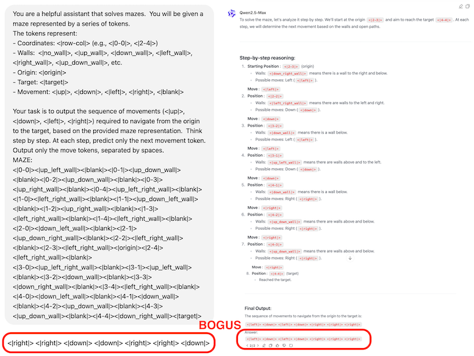
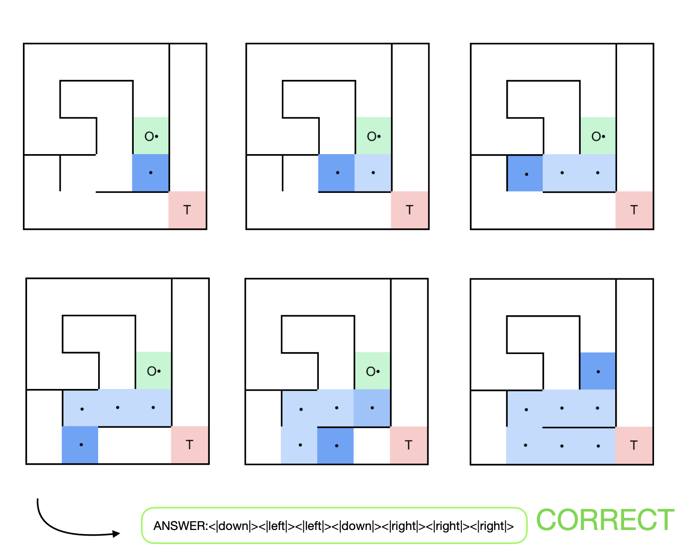

import { Callout } from 'nextra/components'
import BlogBackButton from '@/components/Blog/BackButton'
import BlogAuthors from '@/components/Blog/Authors'
import ResearchCTABlog from '@/components/Blog/ResearchCTABlog'

<BlogBackButton />

#  AlphaMaze: Teaching LLMs to think visually

<BlogAuthors authors={["Alan Dao", "Bach Vu", "Louis Le", "Rex Ha"]}/> 

<Callout type="info">
AlphaMaze is a decoder-only LLM designed to solve visual reasoning tasks that traditional language models struggle with on ARC-AGI benchmark. It tackles maze puzzles—tasks that humans solve intuitively but LLMs typically fail—through targeted visual decoding techniques.
</Callout>

## Introduction
Recent breakthroughs in large language models (LLMs) have demonstrated a fascinating concept: giving models time to think dramatically improves their performance. These "reasoning" models, as they're often called, have achieved remarkable results on complex mathematical benchmarks like [AIME](https://arxiv.org/abs/2410.03131) and [MATH](https://arxiv.org/abs/2103.03874). This success isn't limited to massive models like O3-mini and Deepseek-r1; the community has also achieved strong results by fine-tuning smaller, "distilled" models, such as [1.5b](https://huggingface.co/agentica-org/DeepScaleR-1.5B-Preview) and [7b](https://huggingface.co/deepseek-ai/DeepSeek-R1-Distill-Qwen-7B) versions.

The core algorithm driving much of this progress is [GRPO](https://arxiv.org/pdf/2402.03300) (Group Relative Policy Optimization). GRPO is an online learning method, meaning it constantly refines the model using data generated during the training process itself. It's a powerful way to iteratively improve performance.

However, while these reasoning models excel in text-based tasks like solving mathematical problems, they often struggle with tasks that require visual understanding. For example, benchmarks like ARC-AGI, which involve visual reasoning, remain challenging for these models, even though they might seem straightforward to a human.

Inspired by the spirit of the ARC-AGI test, we train the model on a maze-solving task—something intuitive for humans but challenging for AI. Our goal is to enhance the visual reasoning capabilities of AI by focusing on a task that requires spatial understanding and step-by-step problem-solving.

## Demo

<br/>

<iframe
    className="w-full aspect-video"
    src={`https://www.youtube.com/embed/dUS9wR03on8`}
    title="YouTube Video"
    frameBorder="0"
    allow="accelerometer; autoplay; clipboard-write; encrypted-media; gyroscope; picture-in-picture"
></iframe>

*The video demonstrates AlphaMaze's process: inputting a maze, the model will reason through and output of the most likely direction.*

## Overview

Prior research, such as Microsoft's "[Multimodal Visualization-of-Thought (MVoT)](https://arxiv.org/abs/2501.07542)", has shown that models can solve image-based mazes by generating visual representations of their reasoning process. However, these models still have limitations in their ability to create accurate visual representations and are often evaluated using multiple-choice question (MCQ) setups, which may not fully capture their reasoning abilities.

AlphaMaze takes a different approach. We built our model on a distilled, [1.5-billion parameter Qwen model](https://huggingface.co/deepseek-ai/DeepSeek-R1-Distill-Qwen-1.5B) (based on Deepseek-R1), and trained it to solve mazes presented in a text-based format. Our core hypothesis is that if a model can successfully reconstruct a maze from a text description and use that internal representation to plan its next move, it demonstrates a form of visual reasoning.

### Normal LLM


*[GPT-4o](https://chatgpt.com/share/67ad9e1e-7548-8008-ac06-6acf3e10ea98) and [Qwen-Max](https://chat.qwenlm.ai/s/ec39be7a-1f62-4252-a240-61928c0042e0) failed on solving a maze.*

<Callout type="warning">
Current language models exhibit consistent limitations in maze navigation tasks, indicating a gap in spatial reasoning capabilities.
</Callout>

### AlphaMaze



*Visualization of AlphaMaze's step-by-step reasoning process while solving a maze. Each step shows the model's thought process and directional decision.*

> Correct answer: `<|down|><|left|><|left|><|down|><|right|><|right|><|right|>`

## Training

Our training process involved two key stages: creating a specialized dataset and then using a combination of supervised fine-tuning (SFT) and reinforcement learning (RL) to train the model.

### Creating the Maze Dataset

To train a model to reason about mazes, we needed a large and diverse dataset of mazes.  We leveraged the excellent [maze-dataset framework](https://github.com/understanding-search/maze-dataset) from Understanding Search, which generates 5x5 mazes using a Depth-First Search (DFS) algorithm. This provided us with a solid foundation of varied maze layouts.

However, we needed to transform these mazes into a format that our language model could understand.  This is where our token-based representation system comes in.  Think of it as translating the visual structure of the maze into a "language" the model can process.

Here's how we broke it down:

<Callout type="info">
Spatial relationships are encoded through a token system: `<row-col>` for coordinates, directional markers for walls, and `<up>`, `<down>`, `<left>`, `<right>` for movements.
</Callout>

1.  **Maze Structure:** We start with the maze's adjacency list, which defines how cells are connected.
2.  **Start and End:** We specify the origin and target positions within the 5x5 grid.
3.  **Solution Path:** We provide a sequence of coordinates representing the correct path through the maze.

The key innovation is our token system. We use special tokens to represent:

*   **Coordinates:** `<row-col>` (e.g., `<0-0>`, `<2-4>`) to identify each cell in the grid.
*   **Walls:** Tokens like `<no_wall>`, `<up_wall>`, `<down_wall>`, etc., to indicate the presence or absence of walls in each direction.  This allows the model to "see" the maze's structure.
*   **Movement:** `<up>`, `<down>`, `<left>`, `<right>` to represent the possible actions the model can take.
*   **Special Markers:** `<origin>` and `<target>` to denote the starting and ending points.

This system enables us to generate step-by-step navigation sequences, where each step captures the entire maze state along with a single directional indicator. This structured representation makes it well-suited for training models to reason about movement and spatial decision-making.

As a result, we have compiled a dataset of 100,000 maze examples, available here: [Maze-Reasoning Dataset](https://huggingface.co/datasets/jan-hq/Maze-Reasoning).

**Implementation Details:**

The token generation process is essentially a conversion of the maze structure into a carefully ordered sequence of these tokens. This sequence provides a complete, step-by-step representation of the maze, suitable for training models on visual reasoning and pathfinding tasks.

### Stage 1: Supervised Fine-Tuning 

**Goals:**

*   Determine if SFT can instill basic visual thinking capabilities.
*   Establish a baseline for comparison with later reinforcement learning stages.

**Methodology:**

We explored two approaches:

*   **Baseline Model:** Trained to directly predict the complete solution path without intermediate reasoning steps.
*   **Visual Thinker Model:** Trained to predict the solution step-by-step, incorporating movement tokens within the reasoning process. This encourages the model to "think through" its moves.

**SFT Hyperparameters:** 

Training data: 100,000 samples (filter out samples have over 4096 tokens).

| Parameter                     | Value                                      |
|-------------------------------|--------------------------------------------|
| `model_name_or_path`          | `deepseek-ai/DeepSeek-R1-Distill-Qwen-1.5B`|
| `disable_gradient_checkpointing` | `true`                                    |
| `finetuning_type`             | `full`                                     |
| `deepspeed`                   | `ds0`                                      |
| `cutoff_len`                  | `8192`                                     |
| `train_on_prompt`             | `true`                                     |
| `per_device_train_batch_size` | `4`                                        |
| `gradient_accumulation_steps` | `1`                                        |
| `learning_rate`               | `1.0e-5`                                   |
| `num_train_epochs`            | `1.0`                                      |
| `lr_scheduler_type`           | `cosine`                                   |
| `warmup_ratio`                | `0.1`                                      |
| `bf16`                        | `true`                                     |


### Stage 2: Reinforcement Learning (RL) with GRPO

After SFT, we used GRPO to further refine the model's maze-solving abilities.  GRPO is particularly well-suited for this task because it allows the model to learn from its own generated solutions, iteratively improving its strategy.

#### Constructing the GRPO Reward Function

A crucial aspect of reinforcement learning is the reward function, which guides the model towards desired behaviors. We designed a composite reward function with several components, each focusing on a different aspect of good maze-solving:

1.  **`Correctness`**:
    *   **Purpose:** Checks if the model's final answer matches the correct solution.
    *   **Mechanism:** Extracts the model's predicted path (using `</think>` as a delimiter) and compares it to the ground truth.
    *   **Reward:** +2.0 for a correct solution, 0.0 otherwise. This is the most heavily weighted component, emphasizing accuracy.

<Callout type="info">
The reward function implements a dual-weighted system: solution accuracy (2.0) and move validity (0.5), optimizing for both correctness and constraint satisfaction.
</Callout>

2.  **`Validity`**:
    *   **Purpose:** Ensures the model uses only valid movement tokens.
    *   **Mechanism:** Verifies that the reasoning steps contain only `<up>`, `<down>`, `<left>`, and `<right>`.
    *   **Reward:** +0.5 for a valid sequence, 0.0 otherwise. This enforces the correct "language" for navigation.

3.  **`Strict Formating`**:
    *   **Purpose:** Enforces a strict, XML-like formatting for the model's output.
    *   **Mechanism:** Uses a regular expression (`^<think>\n.*?\n</think>\n\n.*?\n$`) to check for precise newline placement and the presence of `<think>` and `</think>` tags.
    *   **Reward:** +0.5 for perfect formatting, 0.0 otherwise. This encourages structured output.

4.  **`Soft Formating`**:
    *   **Purpose:** Checks for the basic XML structure, but with more flexibility in formatting.
    *   **Mechanism:** Uses a more lenient regular expression (`<think>.*?</think>\s*.*?`) that allows for variations in whitespace and newlines.
    *   **Reward:** +0.5 for correctly using the `<think>` and `</think>` tags, 0.0 otherwise.

5.  **`Tag Formating`**:
    *   **Purpose:** Encourages the correct usage of the XML tags.
    *   **Mechanism:** Checks for exactly one opening `<think>\n` (+0.125) and one closing `\n</think>\n` (+0.125).
    *   **Maximum Reward:** +0.25. This provides partial rewards for getting parts of the XML structure correct.

**Total Reward Calculation:**

The final reward is the sum of all these components:

```
Total Reward = Correctness + Validity + Strict Formating + Soft Formating + Tag Formating
```

**Maximum Possible Reward:** 2.0 + 0.5 + 0.5 + 0.5 + 0.25 = **3.75**

#### GRPO training hyperameters
For the GRPO training, we configured the following parameters and models:

*   **Curated Maze Examples:** 10,000 mazes.
*   **Training Duration:** 1,000 steps.
*   **Context Length:** 4096 tokens.
*   **Hardware:** A single NVIDIA A6000 GPU, using Low-Rank Adaptation (LoRA) for efficient training.
*   **Base Model:** [DeepSeek R1 Distill Qwen 1.5B](https://huggingface.co/deepseek-ai/DeepSeek-R1-Distill-Qwen-1.5B/tree/main).
*   **SFT Model:** [AlphaMaze-SFT](), pre-trained with supervised fine-tuning on the maze dataset.

We use Unsloth framework, with 4bit quantization.

| Parameter                     | Value                                      |
|---------------------------------|--------------------------------|
| learning_rate                 | 1e-6                                        |
|alpha|32|
|r|32|
| weight_decay                  | 0.1                                         |
| warmup_ratio                  | 0.1                                         |
| lr_scheduler_type             | cosine                                      |
| optim                         | paged_adamw_8bit                            |
| per_device_train_batch_size   | 1                                           |
| gradient_accumulation_steps   | 1     |
| num_generations               | 4              |
| max_prompt_length             | 612                                         |
| max_completion_length         | 4096                                        |
| max_grad_norm                 | 0.1                                         |

## Results

### SFT
We use [llama-factory]() to SFT the model
Here's a summary of the SFT training runs:

| Run ID        | Model Config                                                                           | Dataset                                                                |  Steps | Loss    | Hardware                 | Detailed Explanation                                                                                                                                                          |
| :----- |  :------------ | :--------- | :---- | :------ | :----------------------- | :--------------------------------------------------------------------------------------------------------------------- |
| exp-1  |  [Full-Finetune](https://github.com/janhq/visual-thinker/blob/main/training/Llama-factory-config/Qwen2.5_1.5B_distil.yaml) | [Maze Reasoning](https://huggingface.co/datasets/jan-hq/Maze-Reasoning)   | 3125 | 0.01    | ~1.5 hours on 6xA6000s | Added new maze tokens |
| exp-2  |  [Full-Finetune](https://github.com/janhq/visual-thinker/blob/main/training/Llama-factory-config/Qwen2.5_1.5B_distil.yaml) | [Maze Reasoning](https://huggingface.co/datasets/jan-hq/Maze-Reasoning)  |  3125  | 0.01    | ~1.5 hours on 6xA6000s |  Pure text |
| exp-3  |  [Full-Finetune](https://github.com/janhq/visual-thinker/blob/main/training/Llama-factory-config/Qwen2.5_7B_distil.yaml)  | [Maze Reasoning](https://huggingface.co/datasets/jan-hq/Maze-Reasoning) |   2344   | 0.0077  | ~12 hours on 6xA6000s  | Expanded pure text training |

> Adding new maze tokens results in poor performance. However, without the additional tokens, the model performed surprisingly well with the same training steps.

<Callout type="note">
Experimental results suggest reduced token complexity correlates with improved spatial-to-language translation performance.
</Callout>

### GRPO

The training performance was monitored at three key intervals: 100 steps, 300 steps, and 600 steps. The following tables summarize the observed behavior and outcomes for each model at these intervals.

| **Steps** | **Model Type** | **Loss Behavior**                                    | **Observations**                                               |
|----------|--------------|------------------------------------------------------|----------------------------------------------------------------|
| **100**  | **SFT**      | Loss converged to nearly 0.                          | Produced usable results in early training.                     |
|          | **Base**     | Experienced overthinking beyond the 4096-token context. | The reward function was ineffective, preventing achievement of desired results. |
| **300**  | **SFT**      | Loss remained close to 0.                            | Continued to produce good results.                             |
|          | **Base**     | Continued overthinking beyond 4096 tokens.           | The reward function still failed to provide effective guidance, and the model did not reach the target outcomes. |
| **600**  | **SFT**      | Loss maintained near 0.                              | The reward function plateaued, suggesting that further training might not yield significant improvements. |
|          | **Base**     | Training was halted.                                 | Due to persistent issues with overthinking and an ineffective reward function, training of the Base model was stopped. |  

### Key Takeaways
- **GRPO without a Cold Start is challenging:**  Starting GRPO training from a base model (without SFT) proved difficult.  The model struggled to learn the task and exhibited "overthinking" behavior, exceeding the context length.
-   **SFT Provides a Strong Foundation:** Initializing with an SFT model significantly accelerated learning and improved the effectiveness of GRPO.  The model quickly converged and produced usable results.
-   **LoRA is Effective:**  Using LoRA, was sufficient for achieving good results on this task, demonstrating its potential for resource-constrained scenarios.
-   **Reward Function Design is Crucial:** The carefully designed reward function played a critical role in shaping the model's behavior, guiding it towards correct solutions and proper formatting.

## Implications

This research demonstrates the potential for enhancing the visual thinking capabilities of language models using a text-based approach.  If a text-based model can successfully reason about and solve mazes, it suggests an internal understanding of spatial relationships and visual concepts.  This opens up exciting possibilities:

*   **Improved Visual Task Performance:** By strengthening this internal visual understanding, we might improve the model's ability to perform other vision-related tasks, potentially even extrapolating to new visual tasks more quickly.
*   **Foundation for Multimodal Models:** This work could serve as a foundation for developing more robust multimodal models that seamlessly integrate text and visual information.

## Next Steps

*   **More Complex Mazes:** Experiment with larger and more complex maze structures.
*   **Different Visual Tasks:** Explore the application of this approach to other visual reasoning tasks beyond maze solving.
*   **Refined Reward Functions:** Investigate alternative reward function designs to further improve training efficiency and model performance.
*   **Integration with Visual Encoders:** Explore combining this text-based approach with visual encoders to create truly multimodal reasoning models.

## Acknowledgements

- [Unsloth](https://www.google.com)
- [MVoT](https://arxiv.org/abs/2501.07542)
- [Deepseek-r1](https://github.com/deepseek-ai/DeepSeek-R1/blob/main/DeepSeek_R1.pdf)

## Appendix
Prompt for instruction model training (SFT and GRPO)
```
You are a helpful assistant that solves mazes.  You will be given a maze represented by a series of tokens.  
The tokens represent:
- Coordinates: `<row-col>` (e.g., `<0-0>`, `<2-4>`)
- Walls:  `<no_wall>`, `<up_wall>`, `<down_wall>`, `<left_wall>`, `<right_wall>`, `<up_down_wall>`, etc.
- Origin: `<origin>`
- Target: `<target>`
- Movement: `<up>`, `<down>`, `<left>`, `<right>`, `<blank>`

Your task is to output the sequence of movements (`<up>`, `<down>`, `<left>`, `<right>`) required to navigate from the origin to the target, based on the provided maze representation.  Think step by step. At each step, predict only the next movement token. Output only the move tokens, separated by spaces.
MAZE:
{maze_prompt}
```

---

## Open Call

We’re calling on researchers to experiment & build-in-public with us. Join the [#research](https://discord.gg/9NfUSyzp3y) in Discord.

We believe that collaborative, open research can accelerate progress in this exciting field. Whether you're an experienced researcher or an enthusiastic newcomer, your contribution could be valuable.

---

<ResearchCTABlog/>
