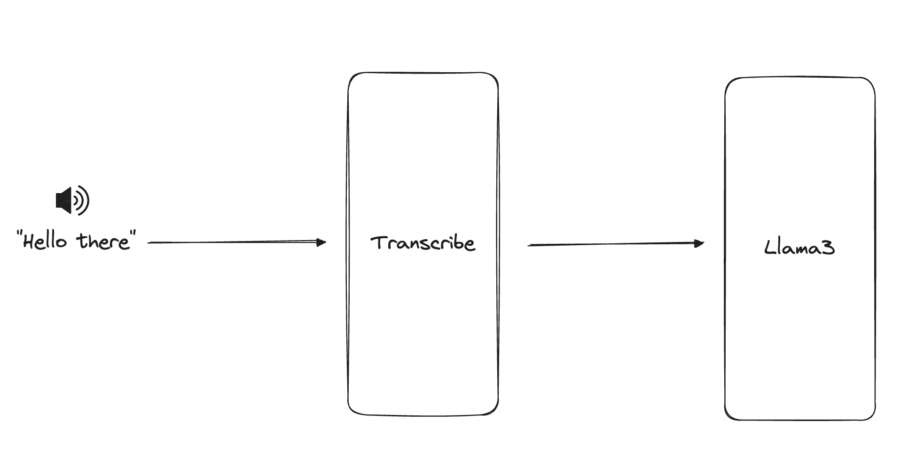
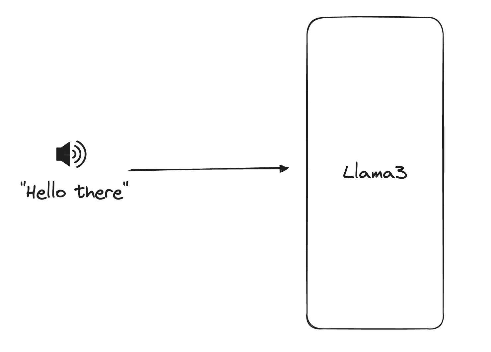
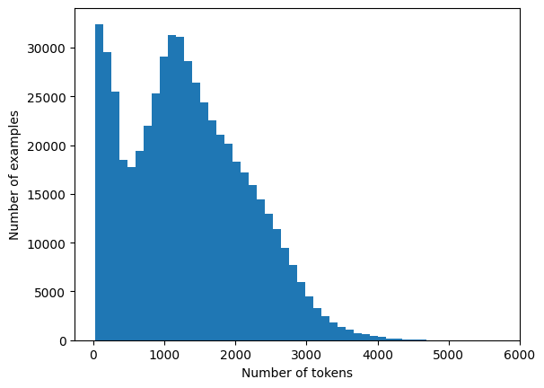
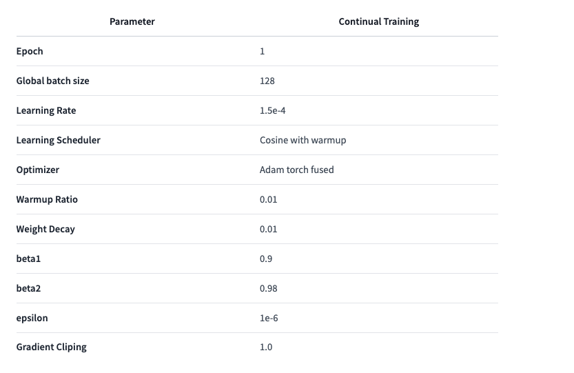
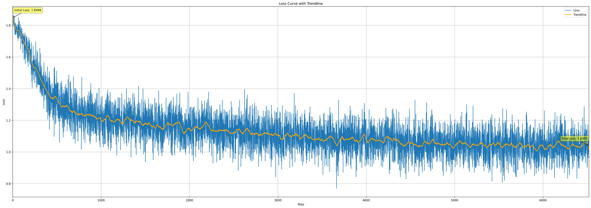
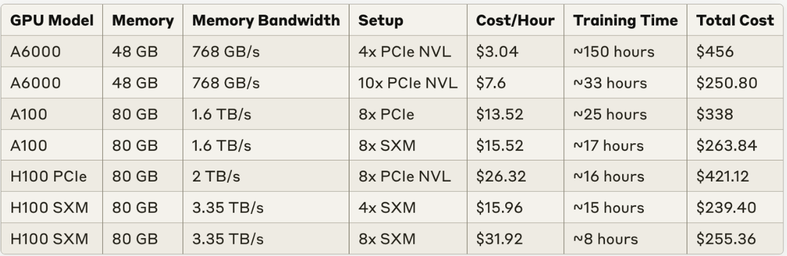

import { Callout } from 'nextra/components'
import BlogBackButton from '@/components/Blog/BackButton'
import BlogAuthors from '@/components/Blog/Authors'
import ResearchCTABlog from '@/components/Blog/ResearchCTABlog'

<BlogBackButton />

# Can llama learn to listen?

<BlogAuthors authors={["Alan Dao", "Rex Ha", "Bach Vu", "Phong Tran"]}/>

<iframe
    className="w-full aspect-video"
    src={`https://www.youtube.com/embed/1Nv831Bf-FY`}
    title="YouTube Video"
    frameBorder="0"
    allow="accelerometer; autoplay; clipboard-write; encrypted-media; gyroscope; picture-in-picture"
></iframe>
*Gradio Demo (19 July 2024): the model “listens” to audio files and does text autocompletion*

We wanted to share **llama3-s**: an open & ongoing research experiment to teach llama3 to listen.

Inspired by the [Chameleon](https://arxiv.org/pdf/2405.09818) and [Llama Herd](https://arxiv.org/pdf/2407.21783) papers, llama3-s is an early-fusion, audio and text, multimodal model. It is trained in the open, with an open-source [codebase](https://github.com/homebrewltd/llama3-s), [open data](https://huggingface.co/datasets/homebrewltd/instruction-speech-v1.5) and [open weights](https://huggingface.co/homebrewltd/llama3-s-2024-07-19).

At a high level, the approach involves using a sound compressor to create discrete token representations of sound. These are then used to train the LLM. The underlying hypothesis is that these new sound tokens can be continuously learned and existing text-based models can find semantic connections between sound tokens and text representations.

In this post, we share results from a [July 19th checkpoint](https://huggingface.co/homebrewltd/llama3-s-2024-07-19). We trained llama3 8b on synthetic audio, via a small training run that cost less than $600, yielding interesting results.


*Image Credit: When llama learns to listen by Cary & Kumar*

---

**Open Call**

This post is also an open call to llm researchers and audio experts. As a nascent research team, Homebrew is our early days of “throw sh*t at the wall and see what sticks”. 

We openly discuss training recipes in Discord, argue it out, and often run the best ideas next day.

Join the Discord fun:

- [#research-livestream](https://discord.com/invite/FTk2MvZwJH): live training & lo-fi music 😂
- [#llama3-s](https://discord.com/channels/1107178041848909847/1269847858379493442): daily ~~arguments~~ discussions
- [#research](https://discord.com/invite/FTk2MvZwJH) : general research & paper sharing


<Callout>
At [Homebrew Computer Company](https://homebrew.ltd), we like smaller, “edge friendly” models that are privacy preserving and feasible to train on energy-efficient clusters. Read more about our [AI philosophy here](https://homebrew.ltd/about).
</Callout>

---

## The Problem

[Cascaded systems](https://arxiv.org/abs/2301.10606) (currently popular in production) take user speech, transcribe it into text, and pass it into an LLM. They have been proven to be slow, inefficient, and [lossy](https://arxiv.org/pdf/2311.06753#page=10&zoom=100,88,489).


*Pictured: Cascaded systems use two separate models. In addition to latency, emotion, tone, many audio features are lost.*

Significant research in this space has been on training true multimodal models that natively understand audio tokens and text tokens. (see [Citations](#citations)).


*Pictured: Multimodal models natively understand text, audio, image input.*

Usually, multimodal model training is quite data expensive and compute intensive. 

Our goal is to see what is practically achievable in practice. We employ a unique combination of aforementioned research, and we constrained ourselves to smaller budgeted runs. Hopefully our initial findings below contribute meaningful learnings.

## Training: 19th July Checkpoint

Our initial goal was to do small, scaling law experiment. We wanted to see how far we’d get **continuously training llama3 on a small set of synthetic, high quality instruct QA pairs**. 

Any initial convergence of audio and text tokens would be have interesting scaling law implications, upon larger and more diverse datasets.

**Data**: For training data, we collated open datasets, consisting of 6 million (15Bn) Q&A text pairs. This was then reduced to 2Mn instruction pairs (4B tokens) through deduping, and filtering for English ([FastText](https://github.com/facebookresearch/fastText)) and token length. We also used additional heuristics based classifiers to filter out bad samples for additional quality. (See [limitations](#current-problems)).



Fig 1. Data tokens length distribution

**Audio generation:** We then used [WhisperSpeech](https://github.com/collabora/WhisperSpeech) text-to-speech model on the default voice tensor to generate an interleaving dataset of 2bn tokens (1Mn. wav files): 

- 80%: audio questions & text answers
- 20%: text questions & text answers (a subset of the 80% audio questions & text answers)

**Audio encoding**: The [Encodec](https://github.com/facebookresearch/encodec) VQ model was used to tokenized the audio files and create sound tokens, compressing each time step into 2D tensors, via 2 channels (24kHz audio file to 1.5 kps)  These audio tokens were then added to llama3’s existing token vocabulary. (See [limitations](#current-problems)).

You can find the datasets here: 

| Date | HF Checkpoint | Tokens |
| --- | --- | --- |
| 📅 2024-07-19 | 🔗 https://huggingface.co/homebrew-research | 🔢 1.35B |
| 📅 2024-07-18 | 🔗 https://huggingface.co/datasets/homebrew-research/instruction-speech-v1.5 | 🔢 800M |
| 📅 2024-06-30 | 🔗 https://huggingface.co/datasets/homebrew-research/instruction-speech-v1 | 🔢 450M |

**Training**: The instruct tuning was done with fsdp2 ([Torchtune](https://github.com/pytorch/torchtune)) mixed-precision, on a [llama3 8b](https://huggingface.co/meta-llama/Meta-Llama-3-8B) base model, with the final weights in bf16. We used the [AdamMini](https://arxiv.org/abs/2406.16793) optimizer, a global batchsize of 128 (mini-batches of 2-4), a 3e-4 learning rate, and a slightly longer warm up ratio. You can find the full steps to reproduce our training here on [Hugging Face](https://huggingface.co/homebrewltd/llama3-s-2024-07-19).



## Results: 19 July Run

This checkpoint was evaluated on held-out datasets not overlapping with training data. 

**Loss Evaluation**: After 2 billion tokens, the model stablised at a loss of ~1.0.


*Pictured: checkpoint 7-19 loss curve.*

**Heuristics Evaluation**: We manually evaluated this checkpoint on 100 samples, scoring the model on a basis of: 

- Answers the spoken question: ~9%
- Somewhat answers the spoken question: ~9%
- Does not answer the spoken question: ~82%

A good answer from the checkpoint:
```yaml
# Question (in audio tokens):
Is the Paris Climate Change agreement going to help slow pollution?

# Expected Output (in text):
Yes, the Paris Climate Agreement is designed to help slow pollution and combat climate change on a global scale. The main goal of the agreement is to limit global warming to well below 2 degrees Celsius, preferably to 1.5 degrees Celsius, compared to pre-industrial levels. To achieve this, countries that have signed the agreement commit to reducing their greenhouse gas emissions...

# Model's Output (in text):
Yes, the Paris Climate Agreement is a global commitment to limit global warming to well below 2 degrees Celsius above pre-industrial levels and pursue efforts to limit it to 1.5 degrees Celsius. The agreement was signed by 195 countries and entered into force on November 4, 2016. 

The agreement sets out a framework for countries to reduce greenhouse gas emissions and adapt to the impacts of climate change. It also encourages countries to increase their ambition and to support developing countries in their efforts to reduce emissions. 

The Paris Agreement is a significant step towards addressing climate change, but it is not a guarantee of success. The agreement requires countries to submit Nationally Determined Contributions (NDCs) outlining their plans to reduce emissions and adapt to the impacts of climate change. The success of the agreement will depend on the ability of countries to meet their NDCs and to work together to address the global nature of climate change.```
```

Conversely, a bad answer from the checkpoint:

```yaml
# Question (in audio tokens):
what is the address to configure a mfm harddrive on a pc without a bios

# Expected Output (in text):
Configuring an MFM (Modified Frequency Modulation) hard drive on a PC without a BIOS (Basic Input/Output System) is a complex task that involves hardware jumpers and possibly some low-level software...

# Model's Output (in text):
The average computer memory (RAM) is typically around 4GB, but it can vary depending on the specific model and manufacturer.
```

Many of the bad answers were "sound similar" hallucinations, e.g. the model mishearing `Gasoline` for `Gaslow`, which is phonetically similar.

```yaml
# Question (in audio tokens):
Why is gasoline a liquid. 

# Expected Output (in text):
Gasoline is a liquid because it is a mixture of hydrogen and oxygen...

# Model's Output (in text):
Gaslow is a city in Scotland...
```

**Degradation Evaluation**: We evaluated whether the checkpoint retained original reasoning with 0 shot MMLU.

| Groups | Version | Original | New | Stderr |
| --- | --- | --- | --- | --- |
| mmlu | 1 | 0.6380 | 0.2478 | 0.0036 |
| - humanities | 1 | 0.5785 | 0.2504 | 0.0063 |
| - other | 1 | 0.7184 | 0.2530 | 0.0078 |
| - social sciences | 1 | 0.7413 | 0.2418 | 0.0077 |
| - stem | 1 | 0.5468 | 0.2448 | 0.0076 |

While this specific checkpoint demonstrated catastrophic forgetting, it has since been addressed. It was a mistake in our tuning parameters, and a 30 July checkpoint with a similar sized training set yielded `0.6137`. 

**Results**: 

| Date | Checkpoint | Tokens | Steps | Loss | GPU hours | All in Cost |
| --- | --- | --- | --- | --- | --- | --- |
| 📅 2024-07-19 | 🔗 https://huggingface.co/homebrewltd/llama3-s-2024-07-19 | 🔢 1.35B | 🔄 1195k | 📉 1.0 | 112(14x8 H100 SXM) | $530 😂 |
| 📅 2024-07-01 | 🔗 https://huggingface.co/homebrewltd/llama3-s-2024-07-08 | 🔢 700M | 🔄 1431k | 📉 1.7-1.8 | 64(8x8 H100s SXM) | $280 |
| 📅 2024-06-23 | 🔗 https://huggingface.co/homebrewltd/llama3-s-init | 🔢 0M | 🔄 N/A | 📉 N/A | N/A | N/A |

<Callout>
We were pleasantly surprised at the initial results under such compute and data constraints. Though, it is too early to conjecture speech & text convergence. 

Minimally, we observed some transitive properties between an LLM’s existing latent text representations and newly learned audio tokens, through just instruct tuning llama3.
</Callout>

**Hardware**: for funsies, we ran our training workload cross various nodes, and measured the following.



## Current Problems

This 19th July checkpoint had limitations.

- Synthetic audio training data (not to mention our generated from a single voice tensor) have been shown to be less effective than ASR or crowdsourced audio.
- Audio compression encoders like Encodec underperform against semantic encoders, or custom encoders for speech.
- Pre-training and subsequent alignment may be strictly necessary.
- As we scale to bigger datasets or models, scaling laws may imply greater loss or degeneration.
- Possibly suboptimal warming-up ratio, learning rate, minor bugs.

## Next Steps

At the moment, we’re working on a new iteration with the following improvements: 

- Retraining phase 1 with llama3.1
- A more diverse synthetic speech set
- Various fixes to hyperparameters, improving degradation
- Training script optimizations
- Better benchmarking

**Have better ideas? >>>>** Join our training in public.

@Emre Can Kartal >>>> pls add newsletter embed

Reviewed by: can credit community for sharing all those papers & feedback here.

## Citations

- [The Llama 3 Herd of Models](https://arxiv.org/pdf/2407.21783)
- [Chameleon: https://arxiv.org/abs/2405.09818](https://arxiv.org/abs/2304.09842)
- [AudioChatLlama: Towards General-Purpose Speech Abilities for LLMs](https://arxiv.org/pdf/2311.06753)
- [AudioLM: a Language Modeling Approach to Audio Generation](https://arxiv.org/pdf/2209.03143)
- [Speech Recognition with Augmented Synthesized Speech](https://ieeexplore.ieee.org/document/9003990)
- [DASB: Discrete Audio and Speech Benchmark](https://arxiv.org/pdf/2406.14294)
- [Qwen-Audio: Advancing Universal Audio Understanding via Unified Large-Scale Audio-Language Models](https://arxiv.org/pdf/2311.07919)

Thank you for reading all the way to the end. Here’s a truth potato as a token of our appreciation. 
](./_assets/llama3s/potatoe.png)
*Artist credit: @harshgopal , @[truth.potato](https://www.instagram.com/truth.potato/)*

<ResearchCTABlog/>