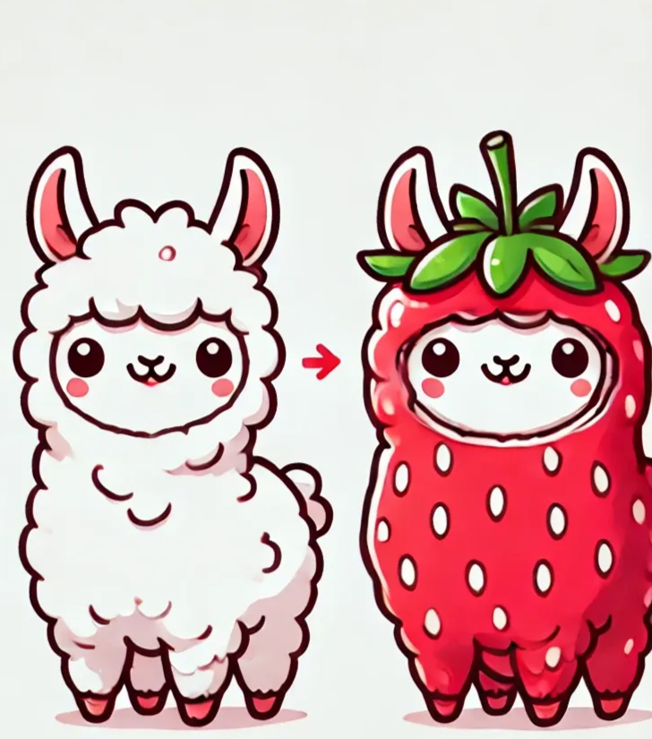
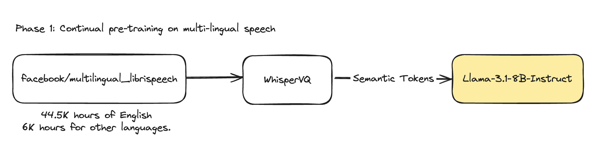
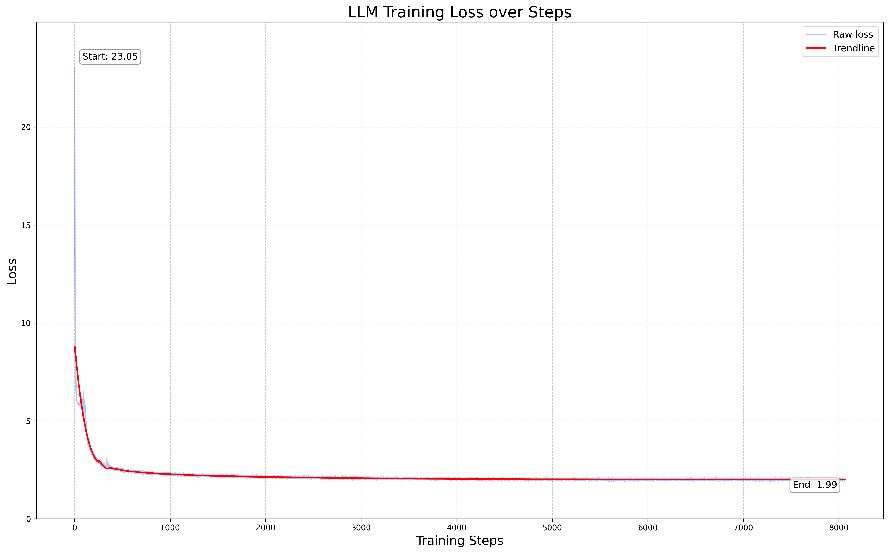
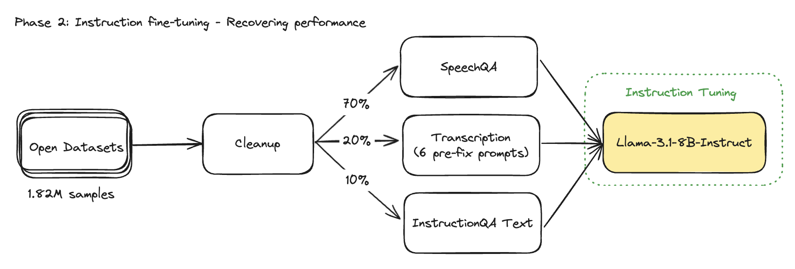
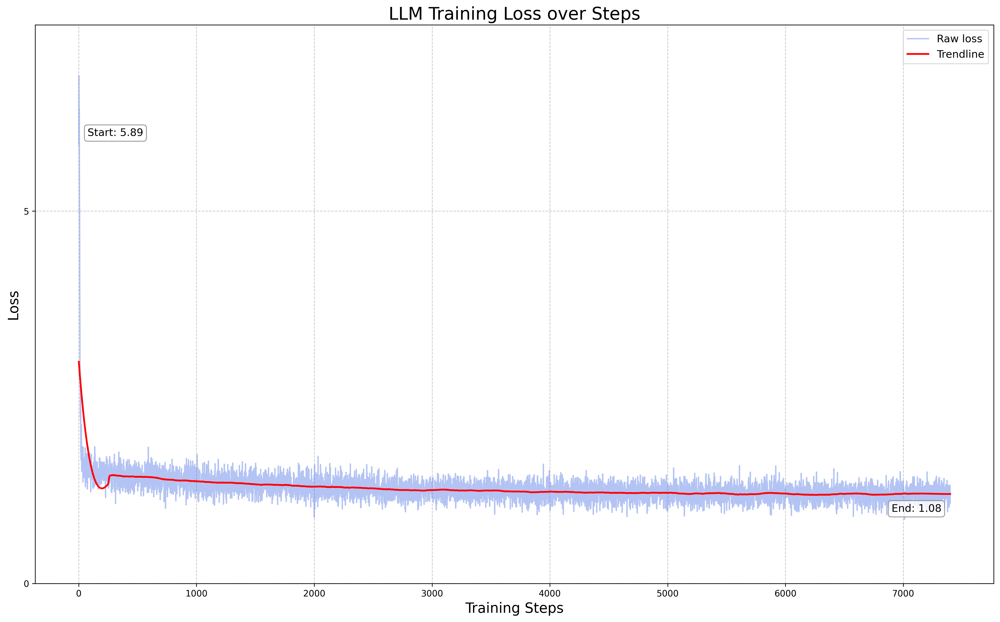
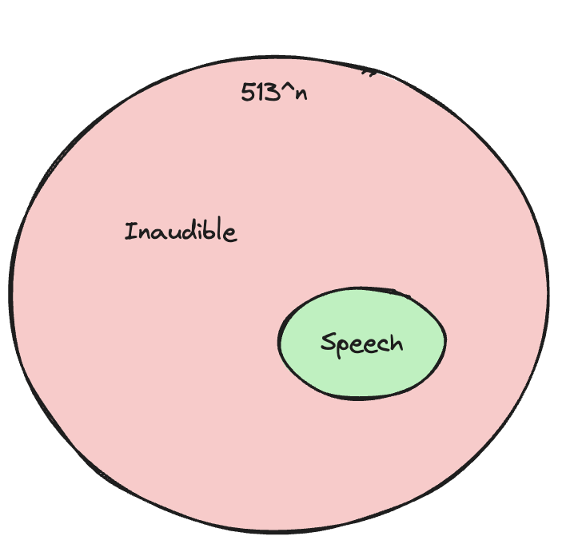
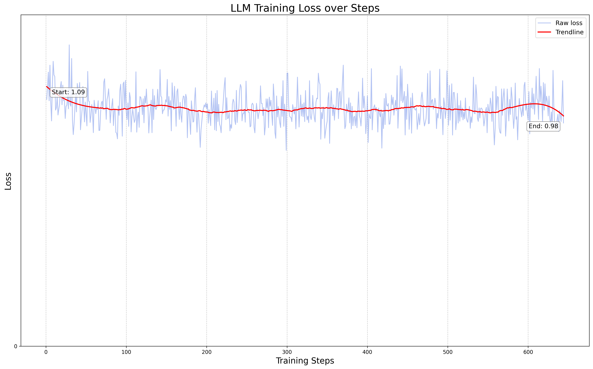
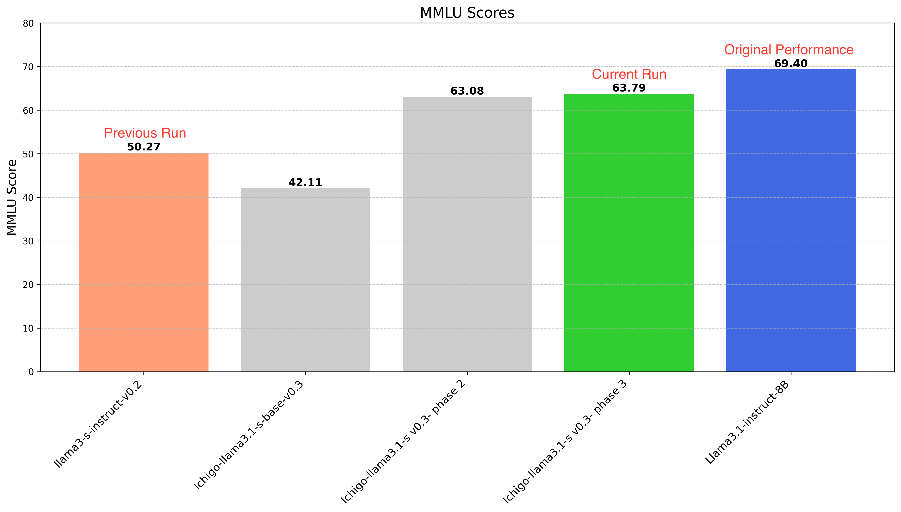

import { Callout } from 'nextra/components'
import BlogBackButton from '@/components/Blog/BackButton'
import BlogAuthors from '@/components/Blog/Authors'
import ResearchCTABlog from '@/components/Blog/ResearchCTABlog'

<BlogBackButton />

# Llama Evolved to 🍓 Ichigo

<BlogAuthors authors={["Alan Dao", "Rex Ha", "Bach Vu"]}/>

<Callout emoji="🍓">
Homebrew’s early-fusion speech model has evolved. Meet 🍓 Ichigo  - the latest llama3-s checkpoint.
</Callout>

Inspired by the [Chameleon](https://arxiv.org/pdf/2405.09818) and [Llama Herd](https://arxiv.org/pdf/2407.21783) papers, llama3-s is an early-fusion, audio and text, multimodal model. We're conducting this research entirely in the open, with an open-source [codebase](https://github.com/homebrewltd/llama3-s), [open data](https://huggingface.co/datasets/homebrewltd/instruction-speech-v1.5) and [open weights](https://huggingface.co/homebrewltd/llama3-s-2024-07-19).

<br></br>

<figure>
  
  <figcaption><i>Image generated by ChatGPT</i></figcaption>
</figure>

## Demo

*A realtime demo of* 🍓 *Ichigo (3rd Oct 2024 checkpoint): the MLLM listens to human speech and responds in text*

### 🍓 Ichigo

**You can try it for yourself:**

- Via our [self-hosted demo here](https://demo.homebrew.ltd/)*
- Via [Hugging Face demo here](https://huggingface.co/spaces/jan-hq/Llama3.1-s-v0.2-checkpoint-2024-08-20)
- [Build it from scratch](https://github.com/homebrewltd/llama3-s)
- [Download Ichigo family](https://huggingface.co/collections/homebrewltd/ichigo-66ffc7484ef31ec5596ef6d0)

**Inference may slow/queued due to shared compute on a single Nvidia RTX4090*

This post shares methodology and results behind this latest checkpoint. As always, this is just the beginning, and we need your ideas to push this research further.

## Change log

From the [llama3-s-v0.2 checkpoint](https://huggingface.co/homebrewltd/llama3-s-instruct-v0.2), we identified several areas for improvement:

1. Pre-training data was English only, limiting multilingual capabilities
2. Significant degradation in the base model's (llama3) capabilities, particularly in [MMLU](https://github.com/EleutherAI/lm-evaluation-harness/blob/0e76386206771143c25b98de977a47cf6055de66/lm_eval/tasks/mmlu/README.md?plain=1#L37) performance
3. Inability to recognize nonspeech inputs, leading to response hallucinations
4. Limited contextual understanding in multi-turn conversations

Ichigo addresses these limitations through a three-phase training approach.

## Training

### Phase 1: Continual Pre-training on Multilingual Speech

**Data:** In this phase we shifted from an [English-only dataset](https://huggingface.co/datasets/parler-tts/mls_eng) to [7 languages dataset](https://huggingface.co/datasets/facebook/multilingual_librispeech). This helps align the model's distribution more closely with the original multilingual training of the base LLM.



**Tokenizer:** To accommodate our shift towards a multilingual dataset, we made a change in our tokenizer from [English-only checkpoint](https://huggingface.co/WhisperSpeech/WhisperSpeech/blob/main/whisper-vq-stoks-medium-en%2Bpl.model) to [7 languages checkpoint](https://huggingface.co/WhisperSpeech/WhisperSpeech/blob/main/whisper-vq-stoks-v3-7lang.model).

**Training**: The pre-training totaled 8064 steps and took over 45 hours on 10xA6000s. We used [Torchtune’s](https://github.com/pytorch/torchtune) Fully Sharded Data Parallels 2 (FSDP2), an AdamW Fused optimizer, along with the following parameters:

| **Parameter** | **Continual Training** |
| --- | --- |
| **Epoch** | 1 |
| **Global batch size** | 480 |
| **Learning Rate** | 2e-4 |
| **Learning Scheduler** | LambdaLR with warmup |
| **Optimizer** | [AdamW Fused](https://pytorch.org/docs/stable/generated/torch.optim.AdamW.html) |
| **Warmup Steps** | 50 |
| **Weight Decay** | 0.005 |
| **Max length** | 512 |
| **Precision** | bf16 |

**Loss**: Training loss converged to just below 2. This loss convergence pattern is similar to what we observed in [our previous run](https://homebrew.ltd/blog/llama3-just-got-ears).



**MMLU Eval**: We measured MMLU at this stage to get a sense of degradation. 5-shot MMLU dropped from [0.69](https://huggingface.co/meta-llama/Llama-3.1-8B-Instruct#instruction-tuned-models) → 0.42 This decrease rate is higher than our previous run.

### Phase 2: Balancing Original Performance and Speech Modality

This phase focused on recovering the model's general capabilities while enhancing its speech-related skills

**Addressing MMLU Performance Drop:** The continual pre-training in Phase 1, while necessary for introducing speech capabilities, significantly reduced the model's original performance. This is a common challenge when retraining a pre-trained model on new vocabulary. Our goal was to recover these capabilities without compromising the newly acquired speech understanding.

<Callout emoji="❗">
Spoiler alert: We recovered MMLU performance from 0.42 to **0.63**, reducing the degradation rate to approximately 10%.
</Callout>

**Optimizing Data and Training Strategies**

**Data:** 

- **Scale:** Increased the data size from 0.92M to 1.89M samples.
- **Diversity:** Expanded topic range on daily conversation, problem-solving scenarios and math solving.
- **Language Focus:** It's important to note that despite the scale-up, we maintained an English-only instruction dataset for this phase.

**Transcription token:** Previously, we used 513 semantic tokens from WhisperVQ's codebook, 2 special tokens for sound input boundaries, and 1 special token for transcription tasks. However, we discovered that the transcription token hindered model recovery.

**Our solution:**

- Replaced the single transcription token with six diverse prompts
- This approach improved the model's ability to map sound token patterns to corresponding text.

| Test Name | Pretrain Checkpoint | Dataset | SpeechQA data | Instruction-text data | Transcription data | Final MMLU Score |
| --- | --- | --- | --- | --- | --- | --- |
| Test 1: Early Pretrain Recovery | 3,000 steps | 500k mixed | ✅ | ✅ | ❌ | 0.55 |
| Test 2: Late Pretrain Recovery | Last | 500k mixed | ✅ | ✅ | ❌ | 0.515 |
| Test 3: Late Pretrain Recovery with Transcription | Last | 500k mixed | ✅ | ✅ | ✅
(With transcription token) | 0.48 |
| Test 4: Extended Late Pretrain Recovery | Last | 1.89M mixed | ✅ | ✅ | ✅
(With transcription prompts) | 0.61 |

**Mixed training data between modalities:** We determined an optimal interleaving of different data types with 70% speech instruction prompts, 20% speech transcription prompts and 10% text-only prompts.



This distribution was not arrived at arbitrarily. We conducted several permutation tests to find the sweet spot that balances speech understanding, transcription abilities, and general language skills.

**Training**: The phase 2 training totaled 7400 steps and took over 10 hours on 8xH100s with the following parameters:

| **Parameter** | **Continual Training** |
| --- | --- |
| **Epoch** | 1 |
| **Global batch size** | 256 |
| **Learning Rate** | 7e-5 |
| **Learning Scheduler** | LambdaLR with warmup |
| **Optimizer** | [AdamW Fused](https://pytorch.org/docs/stable/generated/torch.optim.AdamW.html) |
| **Warmup Steps** | 73 |
| **Weight Decay** | 0.005 |
| **Max length** | 4096 |
| **Precision** | bf16 |

**Loss**: Training loss converged at 1.08



### Phase 3: Teach Ichigo To Say “I cannot hear”

In this final phase, we focused on fine-tuning the model to improve user interaction, particularly in handling inaudible inputs and multi-turn conversations.

**Objectives**

1. Teach the model to recognize and appropriately respond to inaudible inputs
2. Improve context retention in multi-turn conversations with speech input

**Teach model to say “I cannot hear”**

Our initial approach was to create a synthetic dataset of random environmental noises. However, we quickly realized that this method was difficult to scale.

To fix this problem, we hypothesized that meaningful speech typically follows certain patterns. This led us to utilize the 513 sound tokens from the WhisperVQ codebook, and randomize them into similar patterned sequences. This method allowed us to generate a vast amount of "inaudible" input data with a wide distribution. The key insight was that if the model could recognize these chaotic patterns as inaudible input, it would learn to decline responses appropriately.

<figure>
  
  <figcaption><i>Inaudible space is much larger than Speech space</i></figcaption>
</figure>

**To put this in perspective:** With an average speech input of about 50 sound tokens, there are 513^50 possible arrangements. However, only a tiny fraction of these arrangements would constitute meaningful speech. By exposing our model to a wide range of these chaotic arrangements, we taught it to distinguish between audible and inaudible inputs effectively.

**Data:**

**Multi-turn Conversation:**

To enhance multi-turn capabilities with speech input, we fine-tuned the model using 150K samples. The dataset composition was:

- 90% two-turn conversations
- 10% conversations with four or more turns


**Inaudible Refusal data:**

For the inaudible inputs, we employed the [Qwen2.5-72B model](https://huggingface.co/Qwen/Qwen2.5-72B-Instruct) to generate diverse synthetic answers. This process was facilitated through [Distillabel](https://github.com/argilla-io/distilabel), ensuring a wide range of appropriate "decline" responses.

Beyond randomizing sound tokens for inaudible input, we also performed sequence length distribution matching between inaudible and audible data. This ensured a balanced representation of both types of inputs in our training set.

**Training**: The phase 3 training totaled 644 steps and took over 3 hours on 8xH100s with the following parameters:

| **Parameter** | **Continual Training** |
| --- | --- |
| **Epoch** | 1 |
| **Global batch size** | 256 |
| **Learning Rate** | 1.5e-5 |
| **Learning Scheduler** | LambdaLR with warmup |
| **Optimizer** | [AdamW Fused](https://pytorch.org/docs/stable/generated/torch.optim.AdamW.html) |
| **Warmup Steps** | 8 |
| **Weight Decay** | 0.005 |
| **Max length** | 4096 |
| **Precision** | bf16 |

**Loss**: Loss converged at 0.98



## Results

**MMLU:** We recovered the MMLU after phase 1 and maintained the instruct following performance after phase 3
    


> We know that with only MMLU is insufficient to claim recovery. So we will also benchmark on more text-based datasets in our upcoming research paper.

**AudioBench Eval**: [AudioBench](https://arxiv.org/abs/2406.16020) is a June 2024 benchmark designed to evaluate audio large language models (AudioLLMs). It measures speech capabilities, in addition to ASR, transcription, etc., through a compilation of many open datasets.
    
| Model Bench | [Open-hermes Instruction Audio](https://huggingface.co/datasets/AudioLLMs/openhermes_instruction_test)
(GPT-4-O judge 0:5) | [Alpaca Instruction Audio](https://huggingface.co/datasets/AudioLLMs/alpaca_audio_test)
(GPT-4-O judge 0:5) |
| --- | --- | --- |
| [Llama3.1-s-v2](https://huggingface.co/homebrewltd/llama3-s-instruct-v0.2) | 3.45 | 3.53 |
| [Ichigo-llama3.1-s v0.3-phase2 -cp7000](https://huggingface.co/homebrewltd/Ichigo-llama3.1-s-instruct-v0.3-phase-2) | 3.42 | 3.62 |
| [Ichigo-llama3.1-s v0.3-phase2-cplast](https://huggingface.co/jan-hq/llama3-s-instruct-v0.3-checkpoint-last) | 3.31 | 3.6 |
| [Ichigo-llama3.1-s v0.3-phase3](https://huggingface.co/homebrewltd/Ichigo-llama3.1-s-instruct-v0.3-phase-3) | 3.64 | 3.68 |
| [Qwen2-audio-7B](https://huggingface.co/Qwen/Qwen2-Audio-7B) | 2.63 | 2.24 |

## Next steps

🍓 Ichigo is still in early development and has limitations:

- Weak to nonsensical audio in multi-turn conversation
- Multilingual capability hasn’t been fully explored

For now, our next steps are as follows:

- Curate training dataset better, longer prompts, filtering out non-speech-perfect data.
- A more efficient synthetic data pipeline that skips redundant layers
- Establishing cascaded system, baseline, and ASR benchmarks to evaluate computational and improvements across other tasks

**Long term, we aim to develop** 🍓 **Ichigo as a production-level tool that can be integrated in your AI applications.**

## Appendix

**Data distribution:** 

| Task Type | v0.2 | v0.3 |
| --- | --- | --- |
| Speech Multi-turn | None | 140K samples: 2 turns
10K samples >= 4 turns |
| Speech QA | 679K samples | 1.33M samples |
| Transcription | 250K samples
(Using a special token) | 400K samples
(6 different prompts) |
| Noise Audio | None | 8K samples |
| Text-only | None | 100K samples: multi-turn
50K samples: single turn |

**Prompts used for transcription data**

```
Transcribe the following audio clip: <speech>
Convert the spoken words to text: <speech>
What is being said in this audio clip: <speech>
Transcribe the speech in this audio sample: <speech>
Please write down what is being said in the audio clip: <speech>
Generate a transcript from this sound file: <speech>
Recognize the speech in this audio clip: <speech>
Produce a text version of this audio recording: <speech>
```

## **Acknowledgements**

- [OpenSLR](https://www.openslr.org/94)
- [Torchtune](https://github.com/pytorch/torchtune)
- [The Evolution of Multimodal Model Architectures](https://arxiv.org/pdf/2405.17927)
- [Whisper: Robust Speech Recognition via Large-Scale Weak Supervision](https://cdn.openai.com/papers/whisper.pdf)
- [Collabora’s WhisperSpeech (with data from LAION)](https://github.com/collabora/WhisperSpeech)
- [AudioBench: A Universal Benchmark for Audio Large Language Models](https://arxiv.org/pdf/2406.16020)
- [Chameleon: Mixed-Modal Early-Fusion Foundation Models](https://arxiv.org/pdf/2405.09818)
- [Why Warmup the Learning Rate? Underlying Mechanisms and Improvements](https://arxiv.org/pdf/2406.09405)
- [Aya Model: An Instruction Finetuned Open-Access Multilingual Language Model](https://arxiv.org/pdf/2402.07827)
- [The Llama 3 Herd of Models](https://arxiv.org/pdf/2407.21783)
- [Qwen 2.5](https://github.com/QwenLM/Qwen2.5)
- [Distilabel](https://github.com/argilla-io/distilabel)
- [MLS: A Large-Scale Multilingual Dataset for Speech Research](https://arxiv.org/pdf/2012.03411)
- [Yip Jia Qi](https://www.linkedin.com/in/yip-jia-qi): [Discrete Audio and Speech Benchmarks](https://discord.com/channels/1107178041848909847/1269847858379493442/1269906971394576468)
- [Discord Contributors](https://discord.com/channels/1107178041848909847/1269847858379493442): @gau.nerst, @hydroxide, @Blanchon.jl

---

## **Open Call**

We’re calling on LLM researchers and audio experts to experiment with us.

Join the Discord fun:

- [#research](https://discord.gg/9NfUSyzp3y) : general research & paper sharing
- [#llama3-s](https://discord.com/channels/1107178041848909847/1269847858379493442): daily ~~arguments~~ discussions
- [#research-livestream](https://discord.gg/BmA5DbxeEb): live training & lo-fi music 😂

We believe that collaborative, open research can accelerate progress in this exciting field. Whether you're an experienced researcher or an enthusiastic newcomer, your contribution could be valuable.

At [Homebrew Computer Company](https://homebrew.ltd/), we like smaller, “edge friendly” models that are privacy preserving and feasible to train on energy-efficient clusters. Read more about our [AI philosophy here](https://homebrew.ltd/about).

---

<ResearchCTABlog/>
