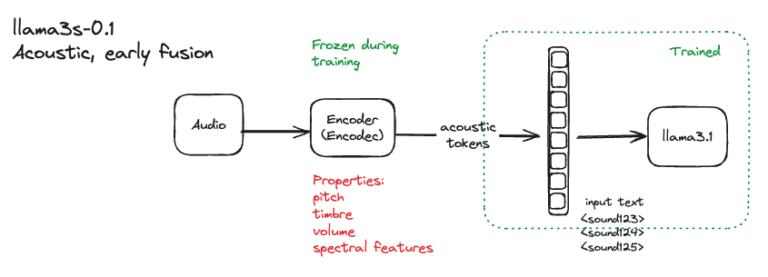
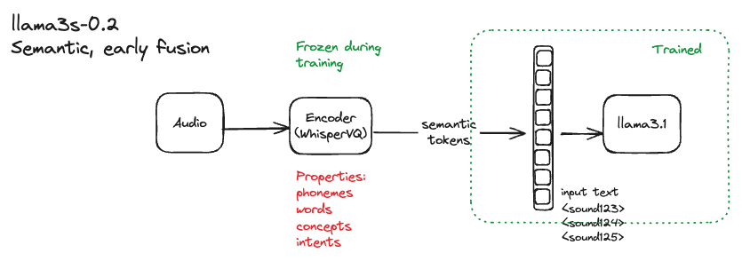
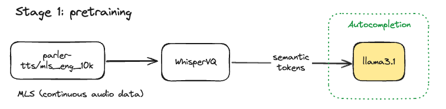
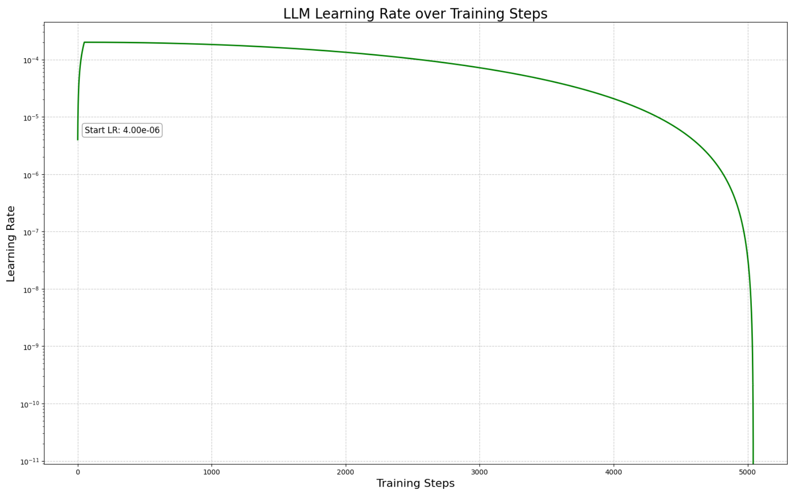
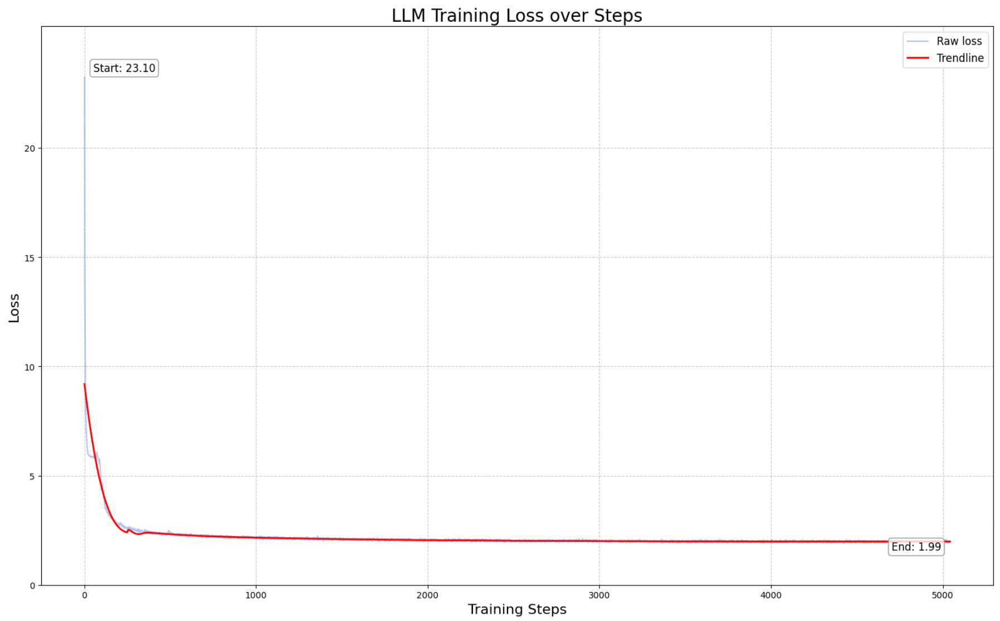
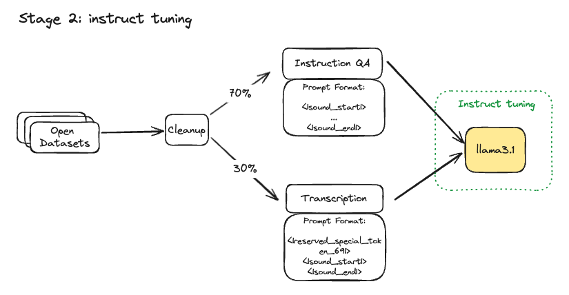
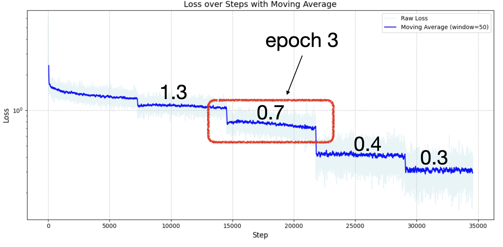
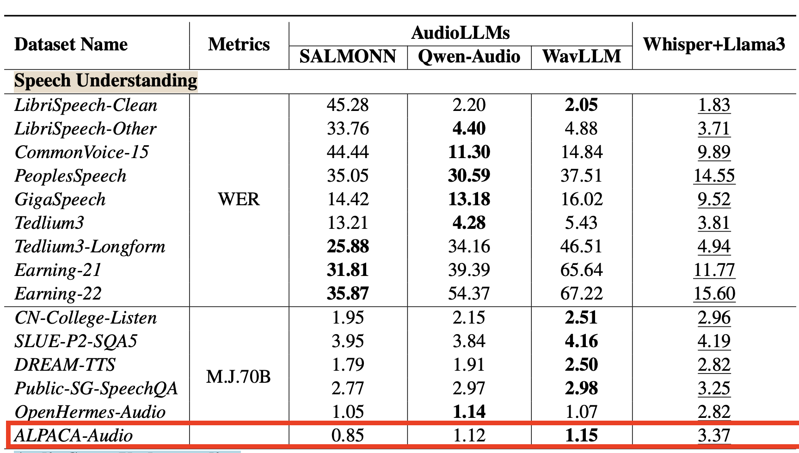
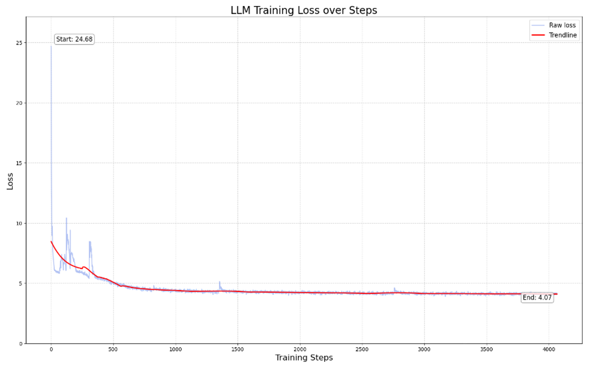
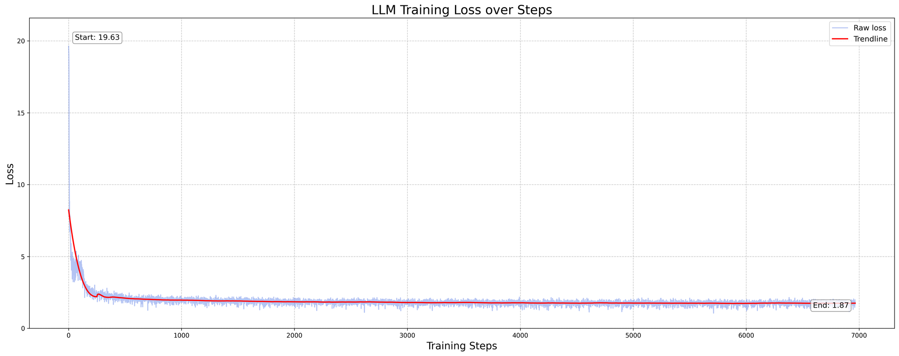

import { Callout } from 'nextra/components'
import BlogBackButton from '@/components/Blog/BackButton'
import BlogAuthors from '@/components/Blog/Authors'
import ResearchCTABlog from '@/components/Blog/ResearchCTABlog'

<BlogBackButton />

# Llama3 just got ears

<BlogAuthors authors={["Alan Dao", "Bach Vu", "Rex Ha"]}/>

We’re excited to share [llama3-s v0.2](https://huggingface.co/homebrewltd/Llama3.1-s-instruct-2024-08-19-epoch-3), our latest multimodal checkpoint with improved speech understanding.

## Demo
<iframe
    className="w-full aspect-video"
    src={`https://www.youtube.com/embed/nfBElfRhitU`}
    title="YouTube Video"
    frameBorder="0"
    allow="accelerometer; autoplay; clipboard-write; encrypted-media; gyroscope; picture-in-picture"
></iframe>
*A realtime demo of Llama3-Speech (23th Aug 2024 checkpoint): the MLLM listens to human speech and responds in text*

**Llama3-s v0.2 consistently performs across multiple `Speech Understanding` benchmarks** (see [Results](#results)). While more analysis is needed, we’re excited to share this progress with the community and get feedback. 

**You can try it for yourself:**
- Via our [self-hosted demo here](https://demo.homebrew.ltd/)*
- Via [Hugging Face demo here](https://huggingface.co/spaces/jan-hq/Llama3.1-s-v0.2-checkpoint-2024-08-20)*
- [Build it from scratch](https://github.com/homebrewltd/llama3-s)

_*Inference may slow/queued due to shared compute_

_*For this round, please ask questions in English and keep them under 10 seconds long. This is due to our model's limitation in being trained on audio prompts with fewer than 500 tokens, which we plan to address in a future update._

This post shares results and methodology behind an Aug 20th checkpoint. As always, this is just the beginning, and we need your ideas to push this research further.

<Callout emoji="📚">
💡 We invite you to join [llama3-s](https://discord.gg/Q7dXd6b9Zb): an ongoing, open-source, and open-data research experiment teaching llama3 to listen. See [motivation](https://homebrew.ltd/blog/can-llama-3-listen#the-problem).
</Callout>

## Architecture

In a [previous post](https://homebrew.ltd/blog/can-llama-3-listen), we shared [llama3-s v0.1](https://huggingface.co/homebrewltd/llama3-s-2024-07-19), an early-fusion experiment where we instruct-tuned llama3 on [encodec’s](https://github.com/facebookresearch/encodec) acoustic tokens [fig 1]. While we observed some transitivity between the LLM’s text and new audio tokens, there were imminent limitations like the lack of generalization to non-synthetic voices, among [other issues](https://homebrew.ltd/blog/can-llama-3-listen#current-problems).

*Fig 1. our previous acoustic tokens early-fusion experiment*

*Fig 2: the current approach is early-fusion with semantic tokens*

**For llama3-s v0.2, we adapted llama3.1 using early-fusion with semantic tokens**, inspired by community [feedback](https://www.reddit.com/r/LocalLLaMA/comments/1emjyq0/comment/lgzm5ap/?utm_source=share&utm_medium=web3x&utm_name=web3xcss&utm_term=1&utm_content=share_button) [fig 2]. Our goal is to leverage the benefits of semantic tokens, such as simplicity, better compression, and consistent speech-feature extraction, as demonstrated by [WhisperVQ](https://huggingface.co/WhisperSpeech/WhisperSpeech/blob/main/whisper-vq-stoks-medium-en%2Bpl.model). We can always scale up to a hybrid approach and reintroduce acoustic features as needed, given more data and compute resources. 

You can learn more about our comparison of semantic and acoustic tokens [here](#acoustic-v-semantic).

## Training

### Stage 1: pre-training on real speech

We found it useful to pre-train llama3.1 on continuous speech, through rough ablation experimentation. This enhanced llama3’s ability to generalize across semantic tokens.

**Data**: We used the [MLS-10k dataset](https://huggingface.co/datasets/parler-tts/mls_eng_10k) (10 hours of unlabeled, multilingual human speech courtesy of OpenSLR) to pre-train llama3.1 8b on next token prediction ([code here](https://huggingface.co/homebrewltd/llama3.1-s-base-v0.2/blob/main/training_config.yaml)). 

**Training**: The pretraining totaled 5k steps and took over 30 hours*. We used [Torchtune’s](https://github.com/pytorch/torchtune) fully sharded data parallels, an AdamW Fused optimizer, along with the following parameters:

| Parameter | Continual Training |
| --- | --- |
| **Epoch** | 1 |
| **Global batch size** | 80 |
| **Learning Rate** | 2e-4 |
| **Learning Scheduler** | LambdaLR with warmup |
| **Optimizer** | [AdamW Fused](https://pytorch.org/docs/stable/generated/torch.optim.AdamW.html) |
| **Warmup Steps** | 20 |
| **Weight Decay** | 0.01 |
| **Gradient Checkpointing** | Full |
| **Max length** | 512 |
| **Precision** | bf16 |

The learning rate schedule is as follows, starting with a relatively high LR for sufficient warmup.

**Loss**: After 5000 steps, loss converged at just below 2, at which point we simply moved onto the next stage.

**Compute**: We used a single 10x RTX A6000 node to train. We actually own and operate our own A6000’s node that we’ve fondly named “Boba”. So, to get a rough cost calculation for this stage, let us assume a higher end rate of USD0.80 per GPU, totaling $240 for the pre-train.

**MMLU Eval**: We measured MMLU at this stage to get a sense of degradation. 0-shot MMLU dropped from 0.63 → 0.46, a 30% decrease that we hoped to recover in the subsequent stage.

### Stage 2: instruct tuning on a mixture of synthetic data

For the second stage of training, we instruct-tuned llama3 with interleaving synthetic data. 

**Data:** We use a synthetically generated [speech dataset](https://huggingface.co/datasets/homebrewltd/instruction-speech-encodec-v1). This speech data is then semantically encoded with [WhisperVQ](https://huggingface.co/WhisperSpeech/WhisperSpeech/blob/main/whisper-vq-stoks-medium-en%2Bpl.model) from [WhisperSpeech](https://github.com/collabora/WhisperSpeech). This dataset was then interleaved to have 70% speech instruction prompts and 30% speech transcription prompts.

**Training**:  The instruct tuning was done with fsdp2, mixed-precision, with the final weights in bf16. We used the AdamW Fused optimizer, a global batchsize of 128 (mini-batches of 2-4), a 0.5e-4 LR, and Cosine learning scheduler. You can find the full steps to reproduce our [training here](https://huggingface.co/homebrewltd/Llama3.1-s-instruct-2024-08-19-epoch-3).

| Parameter | Continual Training |
| --- | --- |
| **Epoch** | 1 |
| **Global batch size** | **128** |
| **Learning Rate** | 0.5e-4 |
| **Learning Scheduler** | Cosine with warmup |
| **Optimizer** | [AdamW Fused](https://pytorch.org/docs/stable/generated/torch.optim.AdamW.html) |
| **Warmup Steps** | 73 |
| **Weight Decay** | 0.005 |
| **Gradient Checkpointing** | Full |
| **Max length** | 1024 |
| **Precision** | bf16 |

**Compute:** The training took place over 32 hours on 8x H100s, spanning 5 epochs at 6 hours & 7261 steps per epoch. At $2.20 per H100 per hour, we estimate this run to have costed $563, not including several failed runs due to troubleshooting. 

Model Flops Utilization (MFU) per step is around [20-25%](https://huggingface.co/homebrewltd/llama3.1-s-instruct-v0.2/blob/main/log_training_v0.2.txt), which is hugely optimizable. It’s also worth mentioning that we intentionally overtrained at this stage to run some [grokking](https://arxiv.org/pdf/2201.02177) experiments.

In total, both stages of training was achievable under $600, with the entire experiment coming under $2800, accounting for various data pipelines and failed runs due to bugs and infrastructure interruptions.

## Results

We found epoch 3 to be performant and is our current demo checkpoint.

**AudioBench Eval**: [AudioBench](https://arxiv.org/abs/2406.16020) is a June 2024 benchmark designed to evaluate audio large language models (AudioLLMs). It measures speech capabilities, in addition to ASR, transcription, etc., through a compilation of many open datasets. 

| **Model Bench** | **[Open-hermes Instruction Audio](https://huggingface.co/datasets/AudioLLMs/openhermes_instruction_test)(GPT-4-O judge 0:5)** | **[Alpaca Instruction Audio](https://huggingface.co/datasets/AudioLLMs/alpaca_audio_test)(GPT-4-O judge 0:5)** | **[Librispeech clean v2](https://huggingface.co/datasets/AudioLLMs/librispeech_test_clean_v2) (ASR) (WER score)** |
| --- | --- | --- | --- |
| [**Llama3.1-s-v2-epoch-1**](https://huggingface.co/homebrewltd/Llama3.1-s-instruct-2024-08-19-epoch-1) | 3.02 | 2.87 | 94.66% |
| [**Llama3.1-s-v2-epoch-2**](https://huggingface.co/homebrewltd/Llama3.1-s-instruct-2024-08-19-epoch-2) | 3.0 | 3.22 | 60.80% |
| [**Llama3.1-s-v2-epoch-3**](https://huggingface.co/homebrewltd/Llama3.1-s-instruct-2024-08-19-epoch-3) | **3.45** | **3.53** | **49.98%** |
| [**Llama3.1-s-v2-epoch-4**](https://huggingface.co/homebrewltd/Llama3.1-s-instruct-2024-08-19-epoch-4) | 3.47 | 2.93 | 60.05% |
| [**Llama3.1-s-v2-epoch-5**](https://huggingface.co/homebrewltd/Llama3.1-s-instruct-2024-08-19-epoch-5) | 3.34 | 3.01 | 69.07% |

Our training dataset didn’t contain Alpaca Instruction. At epoch 3, **llama3-s v.02 achieved an average score of 3.53 on the ALPACA-Audio eval**, which seems to beat SALMONN, Qwen-Audio and WavLLM.

*Fig 3: SOTA models evaluated on AudioBench*

The overfitting started in epoch 4. It is interesting to observe that OpenHermes-Audio eval remaining high after this epoch, likely indicative of some training data contamination. Thus we are inclined to disregard the OpenHermes-Audio criterion.

This checkpoint is bad at ASR, which wasn’t our target, but we included it for good measure. 

**MMLU** eval: Base llama3.1 has an MMLU score of `0.6380`, and degrades to the following across our epochs.

|  | MMLU | Degradation (%) |
| --- | --- | --- |
| Epoch 1 | 0.5139 | 19.45 |
| Epoch 2 | 0.4621 | 27.57 |
| Epoch 3 | 0.4676 | 26.71 |
| Epoch 4 | 0.4720 | 26.02 |
| Epoch 5 | 0.4703 | 26.29 |

## Next Steps

Llama 3.1 v0.2 is still in its early development and has limitations: 

- Model is sensitive to bad compression on the incoming audio
- Model cannot listen to >10s audio and get confused
- Very weak to nonsensical audio and will need to be trained on noise

Additionally, our current approach, a [Type D.1](https://arxiv.org/pdf/2405.17927) multimodal model, has well studied limitations. Namely, there are challenges to scaling the tokenizers and a lack of fine-grained control of how modality information flows in the model. This current approach possibly requires more training data down the road as a tradeoff for its architectural simplicity.

For now, our next steps are as follows:

- Curate training dataset better, longer prompts, filtering out non-speech-perfect data
- A more efficient synthetic data pipeline that skips redundant layers
- Establishing cascaded system baseline benchmarks to evaluate computational and latency improvements
- Exploring other model architectures that are more efficient

**Long term, we aim to develop an open, multi-turn speech model for llama3-s that excels in low-resource languages, with a focus on improving generalization across ASEAN's diverse accents and dialects.** Achieving this will necessitate a significant and sustained data collection effort.

## Acoustic v Semantic

<Callout emoji="💡" >
tldr: Acoustic tokens, though more rich in audio features, requires large training data and computational resources.

</Callout>

The loss on our acoustic tokens pre-training were largely stuck at 4.

Where as pretraining on semantic tokens converged to ~1.8 after 7k steps.

## Acknowledgements

- [OpenSLR](https://www.openslr.org/94)
- [Torchtune](https://github.com/pytorch/torchtune)
- [The Evolution of Multimodal Model Architectures](https://arxiv.org/pdf/2405.17927)
- [Whisper: Robust Speech Recognition via Large-Scale Weak Supervision](https://cdn.openai.com/papers/whisper.pdf)
- [Collabora’s WhisperSpeech (with data from LAION)](https://github.com/collabora/WhisperSpeech)
- [AudioBench: A Universal Benchmark for Audio Large Language Models](https://arxiv.org/pdf/2406.16020)
- [Chameleon: Mixed-Modal Early-Fusion Foundation Models](https://arxiv.org/pdf/2405.09818)
- [Why Warmup the Learning Rate? Underlying Mechanisms and Improvements](https://arxiv.org/pdf/2406.09405)
- [Yip Jia Qi](https://www.linkedin.com/in/yip-jia-qi): [Discrete Audio and Speech Benchmarks](https://discord.com/channels/1107178041848909847/1269847858379493442/1269906971394576468)
- [Discord Contributors](https://discord.com/channels/1107178041848909847/1269847858379493442): @gau.nerst, @hydroxide, @Blanchon.jl

---

## Open Call

We’re calling on LLM researchers and audio experts to experiment with us.

Join the Discord fun:

- [#research](https://discord.gg/9NfUSyzp3y) : general research & paper sharing
- [#llama3-s](https://discord.com/channels/1107178041848909847/1269847858379493442): daily ~~arguments~~ discussions
- [#research-livestream](https://discord.gg/BmA5DbxeEb): live training & lo-fi music 😂

We believe that collaborative, open research can accelerate progress in this exciting field. Whether you're an experienced researcher or an enthusiastic newcomer, your contribution could be valuable.

<Callout>
At [Homebrew Computer Company](https://homebrew.ltd), we like smaller, “edge friendly” models that are privacy preserving and feasible to train on energy-efficient clusters. Read more about our [AI philosophy here](https://homebrew.ltd/about).
</Callout>

---

<ResearchCTABlog/>
